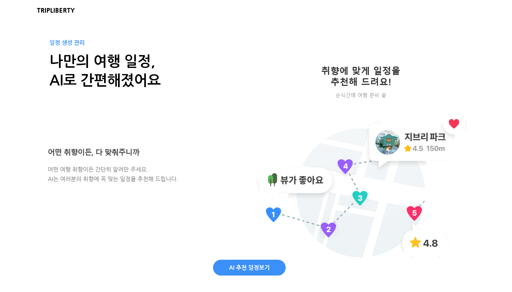
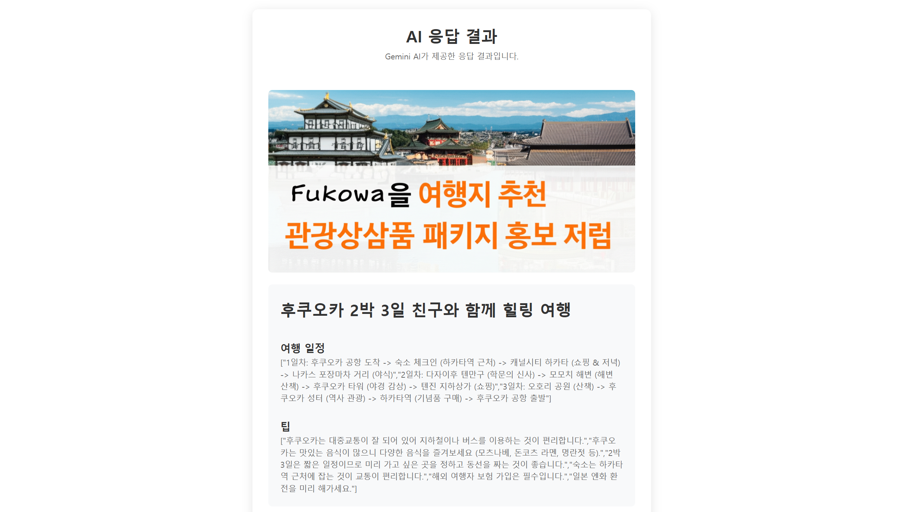

# 트립 플래너 (Trip Planner)


## 📌 프로젝트 소개

여행 일정을 효율적으로 계획하고 관리할 수 있는 React 기반 웹 애플리케이션입니다. Gemini API를 활용한 AI 추천 시스템과 직관적인 UI/UX를 통해 사용자 경험을 최적화했습니다.

[🔗 데모 링크](#) | [📹 시연 영상 보기 (권한 필요)](https://drive.google.com/file/d/1XdiWx130eXT8_j_BWoC7w4W4p85qOFZa/view?usp=drive_link)

> ⚠️ 이 영상은 특정 사용자에게만 공개되어 있습니다. 접근 권한이 없는 경우 요청을 보내주세요.

## ✨ 주요 기능

- **AI 기반 여행 추천**: Gemini API를 활용하여 사용자 선호도 기반 맞춤형 여행지 추천
- **일정 자동 생성**: 선택한 여행지에 대한 최적화된 일정 자동 생성
- **일정 커스터마이징**: 드래그 앤 드롭으로 일정 순서 변경 및 세부 정보 편집
- **오프라인 지원**: 로컬 스토리지 연동으로 오프라인 상태에서도 작업 가능
- **반응형 디자인**: 모바일부터 데스크탑까지 모든 디바이스에서 최적화된 경험 제공

## 🖼️ 스크린샷

<table>
  <tr>
    <td></td>
    <td></td>
    <td></td>
  </tr>
</table>

## 🛠️ 기술 스택


### 추가 라이브러리

- @google/generative-ai: Gemini API 통합
- react-router-dom: 라우팅 관리
- styled-components: 컴포넌트 스타일링
- zustand: 상태 관리
- @craco/craco: Create React App 설정 커스터마이징

## 🧠 기술적 도전 및 해결 방법

- **성능 최적화**:

    - 컴포넌트 메모이제이션 및 가상 스크롤 기법 적용으로 대규모 일정 데이터 처리 최적화
    - 이미지 레이지 로딩 구현으로 초기 로딩 시간 단축

- **컴포넌트 재설계**:

    - 재사용성과 유지보수성을 높이기 위한 컴포넌트 구조 설계
    - 공통 UI 요소를 추상화하여 일관된 사용자 경험 제공
    - 기능별 관심사 분리를 통한 코드 가독성 향상
    - 일관된 네이밍 컨벤션과 폴더 구조 적용으로 유지보수성 강화

- **코드 품질 개선**:

    - 명확한 컴포넌트 명명 규칙 적용으로 코드 탐색 용이성 향상
    - 파일 및 함수 구조의 일관성 유지로 팀 협업 효율성 증대
    - 주석 및 문서화를 통한 코드 이해도 향상

- **상태 관리 최적화**:

    - Zustand를 활용한 전역 상태 관리로 컴포넌트 간 데이터 공유 간소화
    - 스토어를 통한 자유로운 상태 접근 및 업데이트로 props drilling 문제 해결
    - 복잡한 상태 업데이트 로직을 미들웨어로 분리하여 관리

- **상태 동기화**:

    - Zustand와 로컬 스토리지를 연동하여 오프라인 상태에서도 작업 지속 가능

- **UI/UX 개선**:
    - 스켈레톤 로딩, 애니메이션 효과 등을 통해 사용자 경험 향상
    - 접근성 고려한 디자인 및 키보드 네비게이션 지원

## 🚀 설치 및 실행 방법

1. 저장소 클론

```bash
git clone https://github.com/yourusername/trip-planner.git
cd trip-planner
```

2. 의존성 설치

```bash
npm install
# 또는
yarn install
```

3. 환경 변수 설정

```bash
# .env 파일 생성 후 아래 내용 추가
REACT_APP_GEMINI_API_KEY=your_api_key_here
```

4. 개발 서버 실행

```bash
npm start
# 또는
yarn start
```

5. 빌드

```bash
npm run build
# 또는
yarn build
```

## 🗂️ 프로젝트 구조

```
├── node_modules/                 # 프로젝트 의존성
├── public/                       # 정적 파일
├── src/                          # 소스 코드
│
│ ├── assets/                     # 에셋 파일 (아이콘, 이미지 등)
│ │ └── react.svg
│
│ ├── common/                     # 공통 컴포넌트
│ │ ├── Header.jsx
│ │ ├── LoadingSpinner.jsx
│ │ └── ScheduleButton.jsx
│
│ ├── components/                 # 기능별 컴포넌트
│ │
│ │ ├── citycontents/             # 여행 콘텐츠 관련
│ │ │ ├── place/                  # 여행지(국내/해외)
│ │ │ │ ├── Domestic.jsx
│ │ │ │ ├── Foreign.jsx
│ │ │ │ ├── index.jsx
│ │ │ │ ├── TripCompanion.jsx
│ │ │ │ ├── TripDuration.jsx
│ │ │ │ ├── TripPlace.jsx
│ │ │ │ ├── TripSchedule.jsx
│ │ │ │ ├── TripSelection.jsx
│ │ │ │ └── TripStyle.jsx
│ │ │
│ │ └── cityplan/                 # 여행 계획 단계 컴포넌트
│ │     ├── Button.jsx
│ │     ├── ButtonWrapper.jsx
│ │     ├── CityBackButton.jsx
│ │     ├── CityNextButton.jsx
│ │     └── CityProgress.jsx
│
│ ├── data/                       # 정적 데이터 또는 API 연결 모듈
│ │ └── gemini.js                 # Gemini AI 관련 데이터 처리
│
│ ├── hooks/                      # 커스텀 훅
│ │ ├── useGemini.js              # Gemini API 처리 훅
│
│ ├── pages/                      # 주요 페이지 컴포넌트
│ │ ├── AIResultPage.jsx
│ │ ├── CityPlanPage.jsx
│ │ ├── MainPage.jsx
│ │ ├── SchedulePage.jsx
│ │ └── SchedulePageStyle.jsx
│
│ ├── store/                      # Zustand 상태 관리
│ │ └── usePlan.js                # 여행 계획 상태 관리
│
│ ├── styles/                     # 스타일 파일
│ │ ├── ScheduleButton.css
│ │ ├── style.css
│ │ └── TripSelection.css
│
│ ├── App.jsx                     # 앱의 루트 컴포넌트
│ ├── main.tsx                    # 진입점 (Vite용)
│ └── vite-env.d.ts               # 타입 정의
│
├── .env                          # 환경 변수
├── .gitignore                    # Git 무시 파일
├── eslint.config.js              # ESLint 설정
├── index.html                    # HTML 템플릿
├── package.json                  # 프로젝트 메타데이터 및 의존성
├── package-lock.json             # 패키지 의존성 잠금 파일
├── README.md                     # 프로젝트 문서
├── tsconfig.app.json             # TypeScript 앱 설정
├── tsconfig.json                 # 기본 TypeScript 설정
├── tsconfig.node.json            # Node 관련 TypeScript 설정
└── vite.config.ts                # Vite 설정

```
